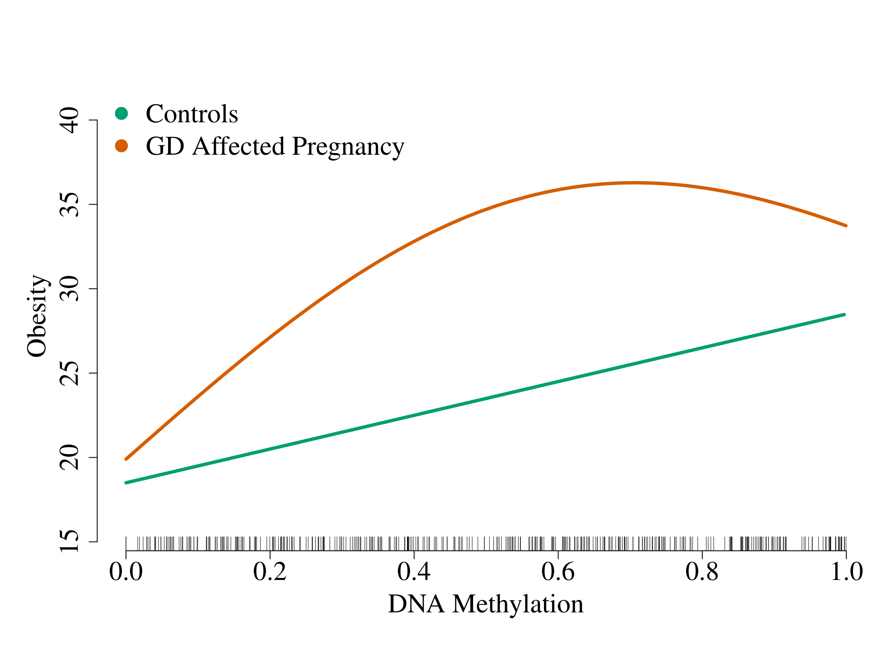

# sail: Sparse Additive Interaction Learning

[](https://travis-ci.org/sahirbhatnagar/sail)   [](https://codecov.io/github/sahirbhatnagar/sail?branch=master)   [](https://cran.r-project.org/package=sail)

`R` software package to fit sparse additive interaction models with the strong heredity property. Interactions are limited to a single exposure or environment variable. The following figure (based on simulated data) gives an idea of the situation our method is trying to capture:



The x-axis is a predictor, the y-axis is the response and each line represents an exposure status. In this example, we see that the effect of the DNA methylation (at one CpG site) on obesity is linear for controls (unexposed: E=0) and non-linear for individuals with a gestational diabetes-affected pregnancy (exposed: E=1). 


## Installation

You can install the development version of `sail` from [GitHub](https://github.com/sahirbhatnagar/sail) with:

```R
if (!require("pacman")) install.packages("pacman")
pacman::p_install_gh("sahirbhatnagar/sail")
```

## Vignette

See the [online vignette](http://sahirbhatnagar.com/sail/) for example usage of the functions.


## Model Input

This method requires four inputs (let _n_ be the number of observations and _p_ the number of **X** variables):  
1. **X**: _n_ x _p_ matrix of covariates. Can be high-dimensional, i.e., p >> n. Can also be continuous, categorical or a combination of both.  
2. **Y**: a continuous response of length _n_  
3. **E**: an exposure variable of length _n_. Can be continous or categorical.    
4. A basis expansion function **f(X_j)** to be applied to each column of **X**, for example 

```R
f.basis <- function(x) splines::bs(x, degree = 5)
```

## Model Output

The `sail` method will search for all main effects and interactions between **E** and **f(X_j)** that are associated with the response **Y**, in a multivariable regression model. It will perform simultaneous variable selection and estimation of model parameters, and return a sparse model (i.e. many parameters with coefficient 0). 


## Model

See the [Introduction to the sail package]() vignette for details on the model. 


## Credit

We make use of the following packages:

* [`glmnet`](https://cran.r-project.org/package=glmnet) for lasso regression  
* [`gglasso`](https://cran.r-project.org/package=gglasso) for group lasso regression  


## Related Work

* [`glinternet`](https://cran.r-project.org/package=glinternet)  
* [`hierNet`](https://cran.r-project.org/package=hierNet)  
* [`FAMILY`](https://cran.r-project.org/package=FAMILY)  
* [`LassoBacktracking`](https://cran.r-project.org/package=LassoBacktracking)    


## Contact

* Issues: <https://github.com/sahirbhatnagar/sail/issues>
* Pull Requests: <https://github.com/sahirbhatnagar/sail/>
* e-mail: <sahir.bhatnagar@gmail.com>


## Latest news

You can see the most recent changes to the package in the [NEWS.md file](https://github.com/sahirbhatnagar/sail/blob/master/NEWS.md)


## Code of Conduct

Please note that this project is released with a [Contributor Code of Conduct](CODE_OF_CONDUCT.md).
By participating in this project you agree to abide by its terms.
