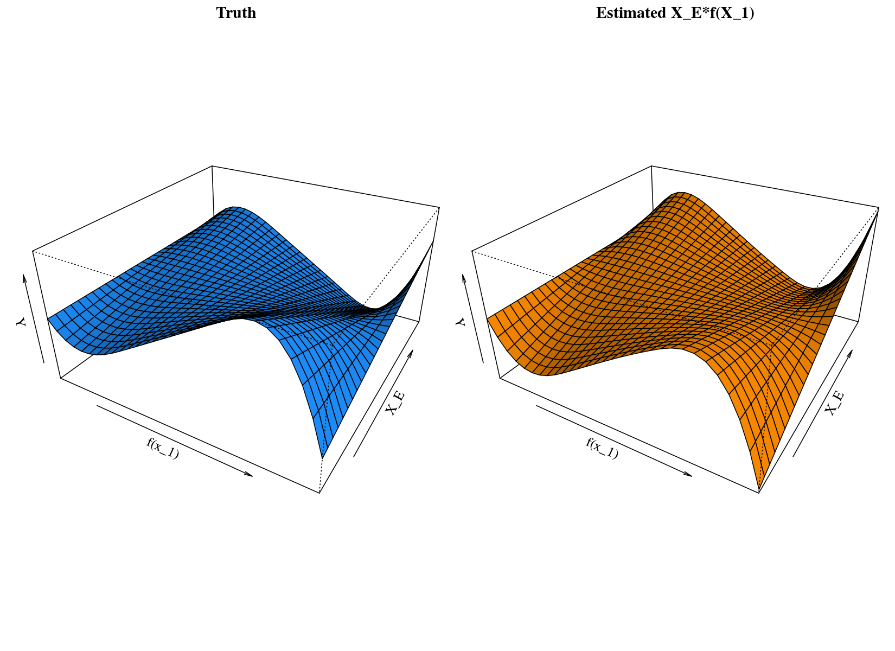

# sail: Strong Additive Interaction Learning

`R` software package to fit additive interaction models with the strong heredity property. Our algorithm fits the following objective function:

\[\arg\min_{\boldsymbol{\Theta} }  \mathcal{L}(Y;\boldsymbol{\beta}) + \lambda_\beta  \left( w_E |\beta_E| + \sum_{j=1}^{p} w_j ||\theta_j||_2 \right) +  \lambda_\gamma \sum_{j=1}^{p} w_{jE} |\gamma_{j}|\]

where

\[\mathcal{L}(Y;\boldsymbol{\beta}) = \frac{1}{2} ||Y - \beta_0 \cdot \boldsymbol{1} + \sum_{j=1}^p \boldsymbol{\Psi}_j \theta_j + \beta_E X_E + \sum_{j=1}^p \gamma_{j}  \beta_E X_E \boldsymbol{\Psi}_j \theta_j||_2^2\]

and

\[f_j(X_j) = \sum_{\ell = 1}^{p_j} \psi_{j\ell}(X_j) \beta_{j\ell}\]

Here, the $\left\lbrace \psi_{j\ell} \right\rbrace_1^{p_j}$ are a family of basis functions in $X_j$. Let $\boldsymbol{\Psi_j}$ be the $n \times p_j$ matrix of evaluations of the $\psi_{j\ell}$ and $\theta_j = (\beta_{j1}, \ldots, \beta_{jp_j}) \in \mathbb{R}^{p_j}$ for $j = 1, \ldots, p$, i.e., $\theta_j$ is a $p_j$-dimensional vector of basis coefficients for the $j$th main effect. 

The following figure shows some results based on simulated data:




## Installation

**Note: this package is under active development**

```{R}
if (!require("pacman")) install.packages("pacman")
pacman::p_load_gh('sahirbhatnagar/sail')
```
